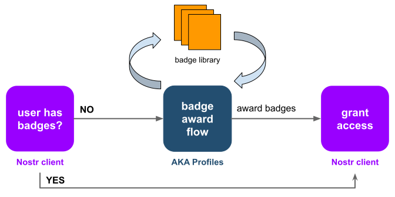

### Disambiguation

Looking for the [AKA Profiles Chrome Extension](https://github.com/neilck/aka-extension)?

## nostr-badges

AKA Profiles is a microservice/app for Nostr badges that can be integrated into any Nostr client.

Your client can provide exclusive access to content or features based on a user's Nostr badges, redirecting users to AKA Profiles to obtain the necessary badges if not yet awarded.

### User Flow
After redirection, AKA Profiles:

1. displays the list of required badges
2. directs the user to the associated badge award web pages
3. records a badge award approvals from each apply web page
4. redirects the user back to the client once all the badges are awarded

_The user flow is similar to OAuth, where the user is directed between different pages via redirects or dialogs._

## Badge Library

The badge library is at the heart of AKA Profiles, enabling badges to be reused as eligibility criteria by multiple clients.

- Select your required badges from the existing badges in the library
- Add your badge to the library for use by your client and other clients

For example, your client could require that a user has the "Not a Robot" badge from the library before they are allowed to post. This badge's `apply web page` requires a user to patch a Captcha.

If none of the library badges meet your needs, you can add your own badge into the library and share it with other clients.

## Latest Changes

### Version 0.2.0
Replaced `verifySession` and `getConfig` endpoints with JWT.
- iframed award badge URLs get `code` 
- award badge pages exchange `code` for web token
- successfully decoding of web token replaces `verifySession`
- inclusion of badge configuration parameters in token replaces `getConfig`
- call to `awardBadge` authorized by token instead of AKA_API_KEY

## Learn more

Still in development. 

Live at [AKA Profiles App](https://app.akaprofiles.com)

See [AKA Profiles Documentation](https://www.akaprofiles.com)

.